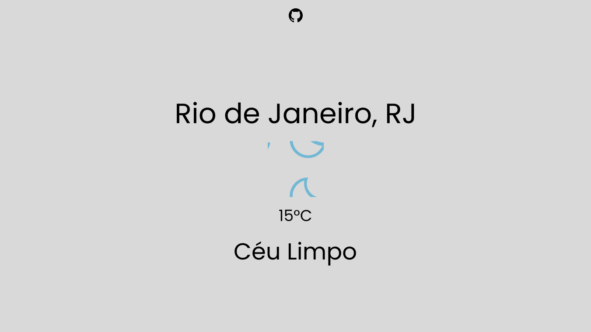

# Clima-API
 Projeto usando Navigator.Geolocation com [Weather API](https://github.com/jhowbhz/weather-api)

 [Site para queira Testar](https://diovanealves.github.io/Weather-API/)

# Novas implementações
- [X] Geolocalização usando Navigator.Geolocation
- [X] API funcionando com Longitude e Latitude
- [X] Mostrar o Resultado no HTML
- [X] Personalização da Pagina
- [X] Criar uma Input para localização sem Navigator.Geolocation

# O que foi Usado no Projeto
[Visual Studio Code](https://code.visualstudio.com)

[Figma](www.figma.com/)

[Flexbox](https://css-tricks.com/snippets/css/a-guide-to-flexbox)

[Font Poppins](https://fonts.google.com/specimen/Poppins?query=poppins)

# Projeto feito no figma

